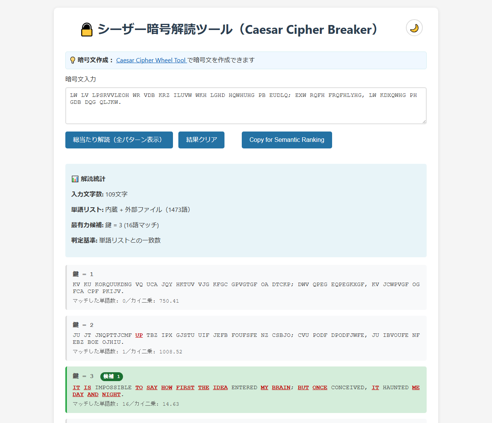
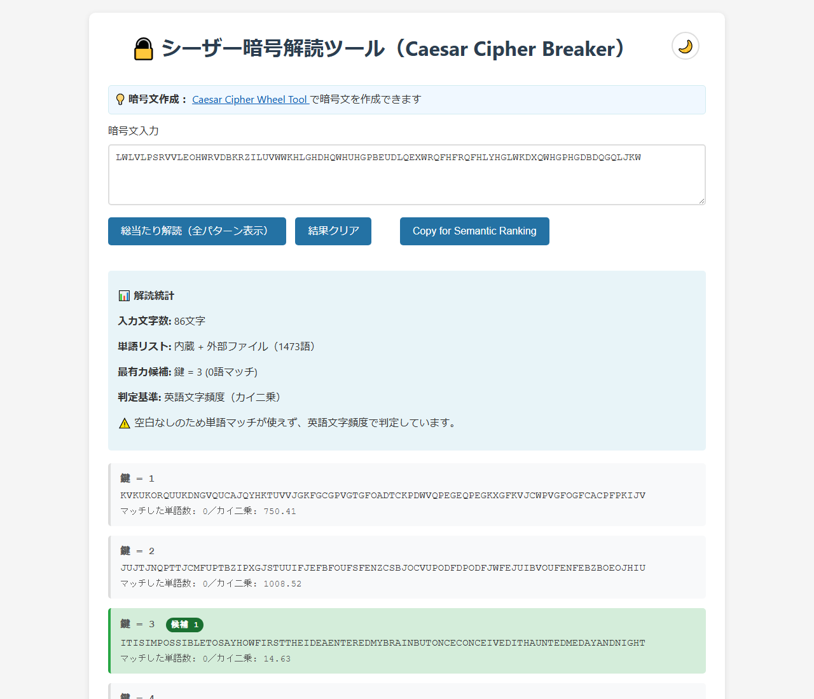
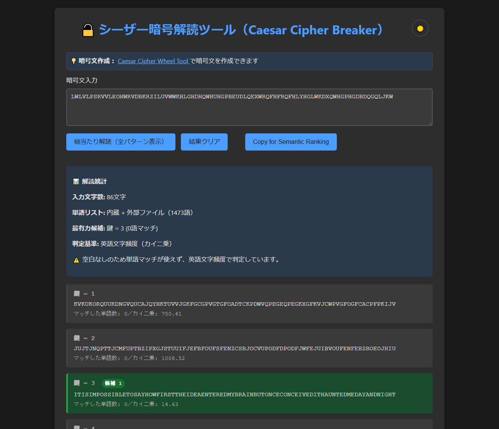

<!--
---
id: day008
slug: caesar-cipher-breaker

title: "Caesar Cipher Breaker"

subtitle_ja: "シーザー暗号総当たり解読ツール"
subtitle_en: "Caesar Cipher Brute-force Decryption Tool"

description_ja: "全25通りのシフトで暗号文を復号し、英単語マッチ数または英語文字頻度のカイ二乗で候補を判定するWebベース解析ツール"
description_en: "Web-based analysis tool that decrypts all 25 shifts and ranks candidates by English word matches or chi-squared letter frequencies"

category_ja:
  - 暗号解析
  - 古典暗号
category_en:
  - Cryptanalysis
  - Classical Cryptography

difficulty: 1

tags:
  - caesar-cipher
  - cryptanalysis
  - brute-force
  - substitution-cipher

repo_url: "https://github.com/ipusiron/caesar-cipher-breaker"
demo_url: "https://ipusiron.github.io/caesar-cipher-breaker/"

hub: true
---
-->

# Caesar Cipher Breaker - シーザー暗号解読ツール

[English](README.en.md) · 日本語


[](https://ipusiron.github.io/caesar-cipher-breaker/)

**Day008 - 生成AIで作るセキュリティツール100**

シーザー暗号の総当たり解読を行うWebベースのツールです。
シフト数1から25までの全パターンを一度に表示し、英語頻出単語との一致数または英語文字頻度のカイ二乗により最有力候補を判定します。
空白なし暗号文にも対応しますが、短文では候補の順位が正解と一致しないことがあります。

## 🌐 デモページ

👉 [https://ipusiron.github.io/caesar-cipher-breaker/](https://ipusiron.github.io/caesar-cipher-breaker/)

## 📸 スクリーンショット

以下は実際の画面例です。

<p align="center">
  
</p>

> *初期暗号文を合併辞書で解読すると、鍵3が16語マッチで候補1になります。*

<p align="center">
  
</p>

> *空白なしの86文字では、英語文字頻度による判定で鍵3が候補1になります。*

<p align="center">
  
</p>

> *同じ解読結果のダークモード表示です。*

## ✨ 機能

### 日本語と英語の切り替え

- 画面右上の言語ボタンで、画面の文言を日本語と英語で切り替える。
- 選んだ言語はlocalStorageに保存し、次回の読み込みでも維持する。
- URLに`?lang=en`または`?lang=ja`を付けて直接指定できる。
- 言語を切り替えても、入力した暗号文と表示中の25候補は消えない。
- 判定の規則としきい値は言語によって変わらない。

### 空白あり暗号文（推奨）

- 単語間にスペースが保持された暗号文。
   - 例：`KHOOR MDSDQ`→`HELLO JAPAN`
- 自動候補判定が効果的に機能。

### 空白なし暗号文（頻度で判定）

- 連続した文字列のみの暗号文。
    - 例：`KHOORMDSDQ`→シフト3で`HELLOJAPAN`
- 全25パターンの復号結果は表示可能。
- 単語マッチの代わりに英語文字頻度のカイ二乗で候補を判定。
- 英字30字未満は低信頼の注記を表示。

**空白なし長文暗号文について**
空白なしの長文暗号文の解析には、頻度分析や統計的手法を用いた別の解読アプローチが有効です。
本ツールもカイ二乗で対応しています。
文字頻度を詳しく調べるDay009の[頻度分析ツール](https://ipusiron.github.io/frequency-analyzer/)も公開済みです（[ソースコード](https://github.com/ipusiron/frequency-analyzer)）。

## 📖 使い方

1. `index.html`をWebブラウザーで開く。
2. テキストエリアに暗号文を入力する。
3. 「総当たり解読（全パターン表示）」ボタンをクリックする。
4. 25パターンの解読結果が表示され、上位3候補が自動判定される。

file://で直接開いた場合は外部辞書を読み込まず、内蔵165語のみを使用します。
外部辞書を含む全機能を使うには、フォルダー内で`python -m http.server`を実行し、`http://localhost:8000/`を開いてください。

HTTP配信で辞書ファイル（`wordlist.txt`）がある場合は、辞書ファイル内の単語＋内蔵の165語を使用します。
一方、辞書ファイルがなかった場合、あるいは読み込めなかった場合は、内蔵の165語のみを使用します。

### 辞書ファイル

- 辞書ファイル名は`wordlist.txt`を固定とする。
- 1行1単語形式。
- ファイル内は大文字で記載されているが、小文字混在でも正常に対応。
- 添付辞書の行数とユニーク語数は次の表のとおり。

| 辞書の項目 | 数値 |
|---|---:|
| 内蔵のユニーク語数 | 165 |
| wordlist.txtの行数 | 1,842 |
| wordlist.txtのユニーク語数 | 1,472 |
| 内蔵と外部を合併したユニーク語数 | 1,473 |

## 📐 画面構成

### 対応文字

- 英語（A-Z, a-z）のみ対応。
- 非英字（数字、記号、スペースなど）はそのまま出力。

### 単語判定

- 空白、カンマ、ピリオド、感嘆符、疑問符などで単語区切りを認識。
- 大文字小文字を区別せずに単語リストと照合。
- マッチした単語は赤系の文字、太字と下線で強調表示。
- 同じ単語が複数回あってもマッチ数は1語として集計。

### 候補判定

- 判定規則に従って上位候補を選び、全25通りは鍵1〜25の順で表示。
- 上位3つを候補1、候補2、候補3として色分け表示。
  - **候補1**: 緑背景（最有力）
  - **候補2**: 青背景
  - **候補3**: 黄背景

### Semantic Ranking用エクスポート

解読結果を他ツールへ渡すためのエクスポート機能です。

- 「Copy for Semantic Ranking」ボタンをクリックすると、全26シフト（0〜25）の復号結果をクリップボードにコピー。
- 出力形式はブロック区切り形式（各ブロックは空行で区切り）。
- このフォーマットは[Semantic Candidate Ranker](https://github.com/ipusiron/semantic-candidate-ranker)がサポートする入力形式に対応。

画面は25通り（シフト1〜25）ですが、エクスポートは連携先の入力仕様に合わせて元の暗号文（シフト0）も含む26ブロックです。

出力フォーマット例です。

```
shift=0
KHOOR MDSDQ

shift=1
JGNNQ LCRCP

shift=2
IFMMP KBQBO
...
```

各ブロックは`shift=N`の行と復号結果の行で構成されます。

### 統計情報

解読結果の上部に以下の統計情報を表示します。

- 入力文字数
- 単語リスト（ソースと語数）
- 最有力候補（鍵とマッチ数）
- 判定基準
- 空白なし暗号文の警告（該当する場合）

各候補ブロックには鍵、マッチした単語数、カイ二乗の値（小数2桁）を表示します。

## 🎯 ユースケース

このツールならではの使い方

- 標本の大きさを体感する（統計の授業）：リンカーンのゲティスバーグ演説の冒頭（空白を除いて英字90字）をシフト3で暗号化し、先頭から1字ずつ増やして解かせる。文字頻度（カイ二乗）の判定で正しいシフトが1位になるのは9字目からで、それ以降は崩れない。8字までは別のシフトが1位になる。何文字あれば統計が当たるかを、手を動かして確かめられる（必要な字数は文によって変わる。本ツールは英字30字未満を低信頼として注記する）
- 「ひと回りで戻る足し算」を学ぶ（数学の授業）：シフト23で暗号化するのと、シフト3で復号するのは同じで、HELLOはどちらでもEBIILになる。時計の12時間や音楽の移調の12の半音と同じ剰余の足し算を、26の場合で確かめる
- 頻度分析をだます文を作る（言葉遊び・作問）：Eを使わない文は文字頻度の判定を外させる。「BUT A FAST GRAY FOX DID JUMP ON A LAZY DOG」（英字32字）をシフト7で暗号化し、空白を消して解かせると、頻度の1位はシフト19になる。空白を残すと単語の一致でシフト7が1位に戻る。30字を超えていても外れる例として、CTFや謎解きの問題に使える

一般的な使い方

- シーザー暗号の学習とCTFの候補確認
- 単語辞書と文字頻度による判定結果の比較
- Semantic Candidate Rankerへ渡す候補の作成

## 🔬 技術的な説明

`caesar-logic.js`が復号、単語判定、カイ二乗とランキングを担当し、`main.js`は画面操作を担当します。
入力に空白文字があり、1語以上マッチする候補が存在する場合は単語マッチ数の降順で判定します。
同数ならカイ二乗の昇順、さらに同じならシフトの昇順です。
空白なし、または全候補のマッチ数が0の場合はカイ二乗の昇順、同値ならシフトの昇順です。
どちらの場合も上位3件に候補番号を付けます。

英字数をn、各文字の出現数をO_c、英語文字頻度（%）をf_cとすると、期待値E_cとスコアは次の式です。

```text
E_c = n × f_c / 100
χ² = Σ(c=A..Z) (O_c − E_c)² / E_c
```

頻度表は[Wiley公開の『Wireless Communications Systems: An Introduction』第1章、図1.6](https://catalogimages.wiley.com/images/db/pdf/9781119419174.excerpt.pdf)に掲載された値と同じです。
合計99.999%の26値をそのまま使用し、大文字化したA〜Zだけを数えます。
英字0文字では算出できないため、画面に「算出不可」と表示します。

初期テキストの英字86字では鍵3の14.63に対して2位の鍵15は247.84ですが、短文では正解が1位になるとは限りません。
10字の`KHOORMDSDQ`では鍵25が23.64で1位になり、正解の鍵3にはなりません。
初期テキストの先頭から英字15〜86字を取り出した範囲では鍵3が1位を保ちましたが、一般的な精度保証ではありません。
本ツールでは英字30字未満を低信頼として注記する設計です。

| 暗号文の例 | 鍵 | 復号結果 |
|---|---:|---|
| `KHOOR MDSDQ` | 3 | `HELLO JAPAN` |
| `KHOORMDSDQ` | 3 | `HELLOJAPAN` |

## 🔒 セキュリティ

暗号文と解読結果はブラウザー内で処理し、外部送信しません。
HTTP配信時の追加通信は同じ配信元の`wordlist.txt`の取得だけです。
localStorageに保存するのはテーマのlight／darkと言語のja／enだけで、暗号文は保存しません。
画面表示はDOM要素とtextContentで構築します。

CSPをmetaで設定し、スクリプトとスタイルを同一配信元に制限しています。
インラインスタイルを使わず、object-srcをnone、base-uriとform-actionをselfに制限しています。
GitHub Pagesでは独自のレスポンスヘッダーを設定できないため、ヘッダー専用の`frame-ancestors`によるクリックジャッキング対策は指定できません。
metaに書いても無効なので含めていません。

## ⚠️ 注意

- 候補の順位は平文の正しさを保証しない。特に短文では目視確認が必要である。
- 英語以外の文章には英語頻度のスコアをそのまま適用できない。
- シフト0は画面の解読候補に含まれないが、エクスポートには含まれる。

## 🧪 テスト

Node22以上で、依存パッケージを追加せずに実行できます。

```sh
npm test
```

node --testで既知解答、全シフトの往復、ランキング規則、短文で鍵25になる限界、HTML、配色と整形を検証します。
日英の辞書についても、キーの一致、差し込みの名前、訳し忘れの日本語、状態を文言で判定していないことを検証します。
READMEの辞書数値、復号例、画像参照も実ファイルからテストします。
GitHub Actionsでpushとpull_requestの両方に対して自動実行します。

## ❓ FAQ

### file://で辞書が165語になる理由

ローカルファイルへのfetchはブラウザーで制限されるため、取得せず内蔵辞書だけを使います。
HTTP配信では合併した1,473語を使います。

### 空白なし短文の正解が1位にならない理由

文字数が少ないと出現頻度が英語の平均から大きく偏るためです。
全25通りの結果を確認し、必要に応じて意味による候補評価も併用してください。

## 🔗 参考

- [Caesar Cipher Wheel Tool](https://ipusiron.github.io/caesar-cipher-wheel/)
- [Frequency Analyzer（Day009）](https://github.com/ipusiron/frequency-analyzer)
- [Semantic Candidate Ranker](https://github.com/ipusiron/semantic-candidate-ranker)

## 📁 ディレクトリー構造

```
caesar-cipher-breaker/
├── index.html          # メインHTMLファイル
├── i18n.js             # 日英の辞書と言語切り替え
├── caesar-logic.js     # 復号・単語判定・カイ二乗・ランキング
├── main.js             # DOM描画・辞書取得・テーマ・コピー
├── style.css           # スタイルシート
├── wordlist.txt        # 辞書1,842行・ユニーク1,472語（変更なし）
├── package.json        # 依存なしのnpm test
├── test/               # ロジック・スコア・README・HTML・配色・整形・日英辞書の7テストファイル
├── assets/             # screenshot.png〜screenshot3.png
├── .github/workflows/  # Testワークフロー
├── .claude/            # ローカル開発用スキル等（Git管理外）
├── ss1.png             # スクリーンショット（初期画面）
├── ss2.png             # スクリーンショット（解読結果）
├── README.md           # 本ドキュメント
├── README.en.md        # 英語版ドキュメント
├── LICENSE             # MITライセンス
├── CLAUDE.md           # Claude Code用設定
├── .gitignore          # Git除外設定
└── .nojekyll           # GitHub Pages用設定
```

## 💻 動作環境

Chrome・Edge・Firefox・Safariの最新版を想定しています。
file://で直接開いても動作しますが、辞書は内蔵165語のみです。
テストにはNode22以上を使用します。ビルドやnpm installは不要です。

## 📄 ライセンス

- ソースコードのライセンスは `LICENSE` ファイルを参照してください。

## 🛠️ このツールについて
本ツールは、「生成AIで作るセキュリティツール100」プロジェクトの一環として開発されました。
このプロジェクトでは、AIの支援を活用しながら、セキュリティに関連するさまざまなツールを100日間にわたり制作・公開していく取り組みを行っています。

プロジェクトの詳細や他のツールについては、以下のページをご覧ください。

🔗 https://akademeia.info/?page_id=42163
