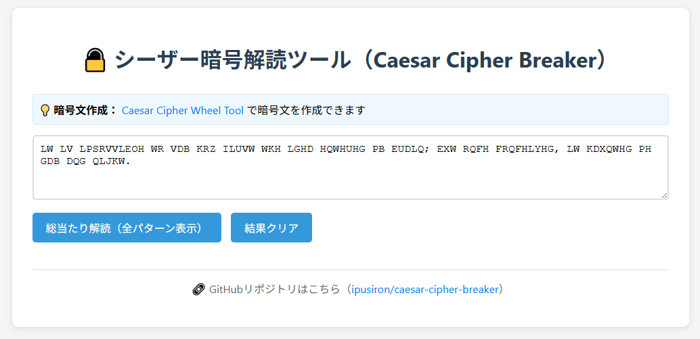

# シーザー暗号解読ツール（Caesar Cipher Breaker）

**Day 7 - 生成AIで作るセキュリティツール100**

シーザー暗号の総当たり解読を行うWebベースのツールです。
シフト数1から25までの全パターンを一度に表示し、英語頻出単語との一致数により自動的に最有力候補を判定します。

このツールは単語間に空白がある暗号文の解読に最適化されています。

## デモページ

👉 [https://ipusiron.github.io/caesar-cipher-breaker/](https://ipusiron.github.io/caesar-cipher-breaker/)

## スクリーンショット

以下は実際の画面例です。

> 
>
> *初期画面*

>
>
> *解読結果*

## 対象暗号文の種類

### 空白あり暗号文（推奨）
- 単語間にスペースが保持された暗号文。
   - 例：`KHOOR MDSDQ`→`HELLO JAPAN`
- 自動候補判定が効果的に機能。

### 空白なし暗号文（制限あり）
- 連続した文字列のみの暗号文。
    - 例：`KHOORMSDSDQ`
- 全25パターンの復号結果は表示可能。
- ただし単語マッチングが困難なため候補推定は信頼性が低い。
- 短い暗号文（10文字以下程度）を除き、辞書単語とのヒット率が大幅に低下。

**空白なし長文暗号文について**
空白なしの長文暗号文の解析には、頻度分析や統計的手法を用いた別の解読アプローチが有効です。
このような暗号文に特化した専用解読ツールを別途開発予定です。

## 使用方法
1. `index.html`をWebブラウザーで開く。
2. テキストエリアに暗号文を入力する。
3. 「総当たり解読（全パターン表示）」ボタンをクリックする。
4. 25パターンの解読結果が表示され、上位3候補が自動判定される。

なお、辞書ファイル（`wordlist.txt`ファイル）がある場合は、辞書ファイル内の単語＋内蔵の165語を使用します。
一方、辞書フィあるがなかった場合、あるいは読み込めなかった場合は、内蔵の165語のみを使用します。

## 辞書ファイルに対応
- 辞書ファイル名は`wordlist.txt`を固定とする。
- 1行1単語形式。
- ファイル内は大文字で記載されているが、小文字混在でも正常に対応。
- 添付した辞書ファイルには、デフォルトで約1,000語の英語頻出単語を頻出順に配列してある。

## 機能詳細

### 対応文字
- 英語（A-Z, a-z）のみ対応。
- 非英字（数字、記号、スペースなど）はそのまま出力。

### 単語判定
- 空白、カンマ、ピリオド、感嘆符、疑問符などで単語区切りを認識。
- 大文字小文字を区別せずに単語リストと照合。
- マッチした単語は赤文字で強調表示。

**重要な制限事項：**
- 空白なしの暗号文では単語境界が不明なため、マッチング精度が大幅に低下。
- 連続文字列内の部分的な単語マッチは偶然の一致である可能性が高い。
- 空白なし暗号文の場合、目視による平文らしさの判定を推奨。

### 候補判定
- マッチした単語数が多い順に自動ソート。
- 上位3つを候補1、候補2、候補3として色分け表示。
  - **候補1**: 緑背景（最有力）
  - **候補2**: 青背景
  - **候補3**: 黄背景

## テスト方法

### 空白あり暗号文（推奨テスト）
暗号文例`KHOOR MDSDQ`を入力してテスト可能。
- シフト3で`HELLO JAPAN`に復号。
- `HELLO`、`JAPAN`が赤文字でハイライト。
- 候補1として正しく判定される。

### 空白なし暗号文（参考テスト）
暗号文例`KHOORMSDSDQ`を入力した場合。
- シフト3で`HELLOJAPAN`に復号。
- 25パターンすべて表示されるが、単語マッチは困難。
- 目視による平文判定が必要。

## 統計情報
解読結果の上部に以下の統計情報を表示：
- 入力文字数
- 単語リスト（ソースと語数）
- 最有力候補（鍵とマッチ数）
- 判定基準
- 空白なし暗号文の警告（該当する場合）

## ライセンス
このプロジェクトはMITライセンスの下で公開されています。 教育目的での自由な利用・改変・再配布が可能です。

**このツールについて**
本ツールは、「生成AIで作るセキュリティツール100」プロジェクトの一環として開発されました。
このプロジェクトでは、AIの支援を活用しながら、セキュリティに関連するさまざまなツールを100日間にわたり制作・公開していく取り組みを行っています。

プロジェクトの詳細や他のツールについては、以下のページをご覧ください。
🔗 https://akademeia.info/?page_id=42163
